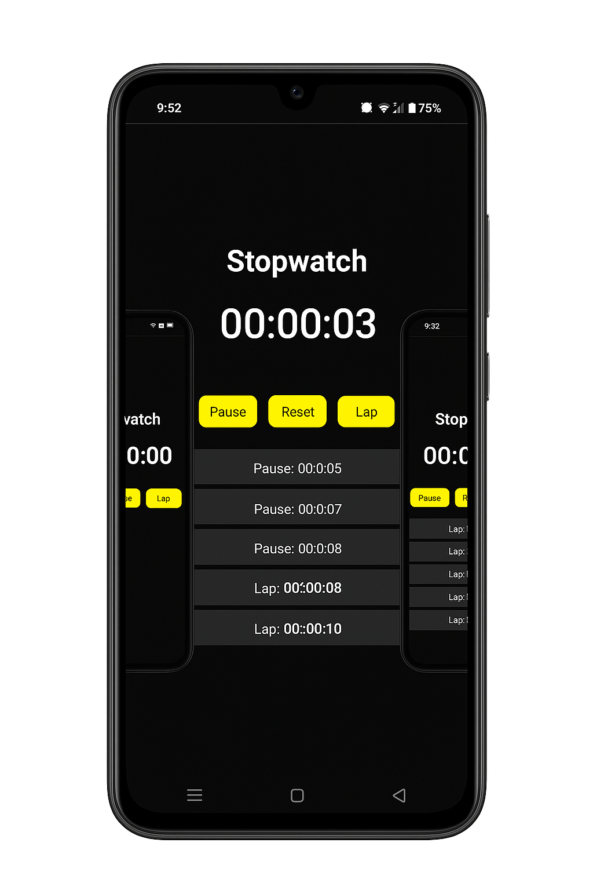
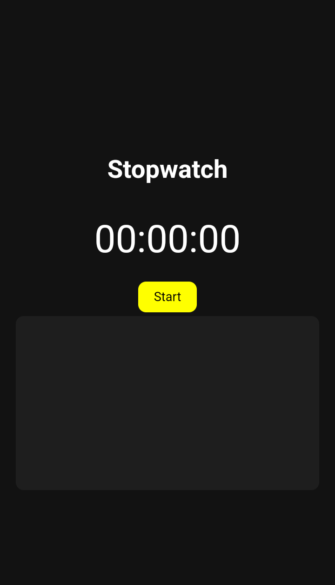
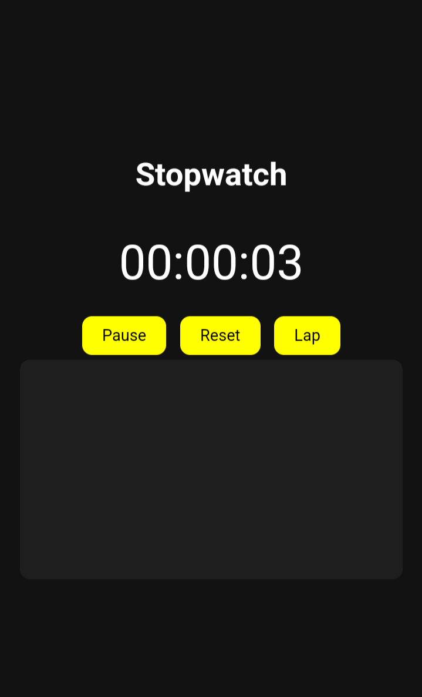
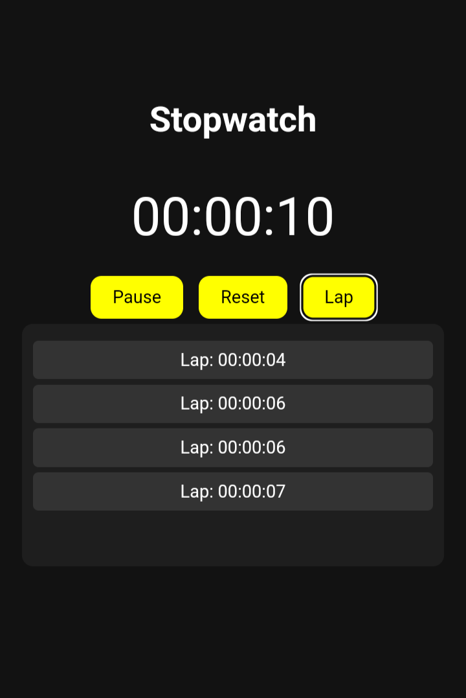
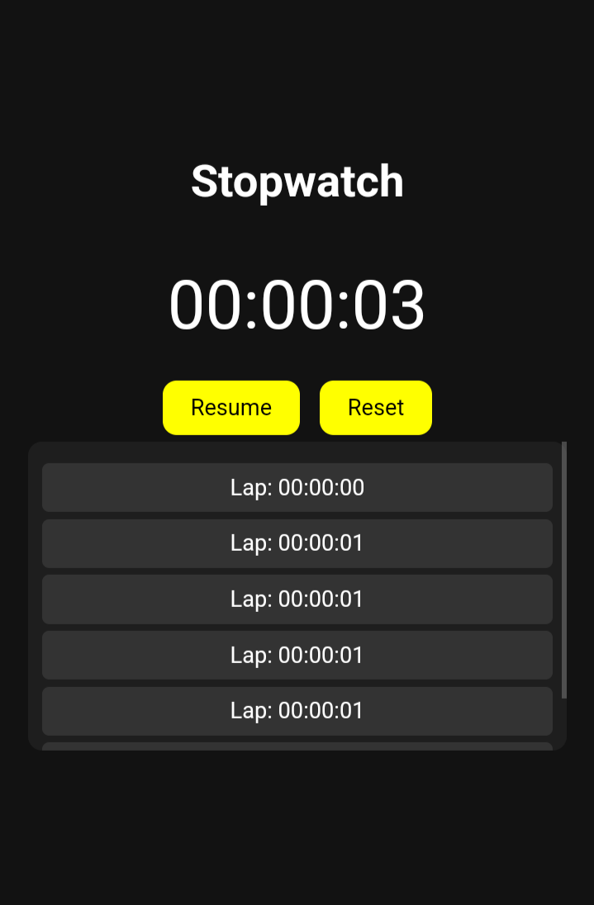

# ⏱️ Stopwatch Web Application

A fully functional and mobile-responsive **Stopwatch Web App** developed using **HTML, CSS, and JavaScript**.  
This project was built as part of my internship at **SkillCraft Technology (Task 02)**.

---

## 🚀 Features

- ✅ Start, Pause, Resume, and Reset stopwatch
- 🏁 Record multiple lap times
- 🖥️ Real-time digital timer in HH:MM:SS format
- 📱 Mobile-friendly responsive design
- 📜 Scrollable lap section to prevent layout shifting

---

## 🧰 Tech Stack

- **HTML5** – Markup structure
- **CSS3** – Styling and responsive layout
- **JavaScript (Vanilla)** – Stopwatch logic, event handling, DOM updates

---

## 📸 Screenshots

### 🟢 Stopwatch UI (Mobile View)



### 🟣 Lap Time Recording


### 🟡 Stopwatch in Action
  
  
  



> 💡 *UI also works on desktop, but designed mobile-first.*

---

## 🛠️ How It Works

- Uses `setInterval()` to update the timer every second
- Lap times are added dynamically using JavaScript DOM methods
- Lap section is scrollable to avoid layout overflow
- The Resume button continues timer after pause without resetting

---

## 🧪 Learning Outcomes

- Improved understanding of JavaScript timing functions
- Built a complete project using event-driven programming
- Practiced CSS layout techniques and mobile responsiveness
- Applied DOM manipulation and dynamic content rendering

---

## 🌐 Live Demo

🔗 [**View the Project on GitHub Pages**](https://codingwithpavani.github.io/SCT_WD_2/)  
🔗 [**Source Code on GitHub**](https://github.com/codingWithPavani/SCT_WD_2)


---

## 📁 Project Structure

```bash
stopwatch-app/
│
├── index.html        # Main HTML structure
├── style.css         # Styling for layout and components
├── script.js         # Stopwatch functionality and logic
├── screenshots/      # Optional folder for UI images
└── README.md         # Project documentation
```

---

## 🙋‍♀️ Author

**Pavani Abothula**  
🎓 B.Tech CSE Student | Frontend Intern at SkillCraft Technology  
🔗 [LinkedIn](https://www.linkedin.com/in/pavani-abothula)  
💻 [GitHub](https://github.com/codingWithPavani)  
✉️ abothulapavani16@gmail.com

---

## 📄 License

This project is open-source and free to use.
